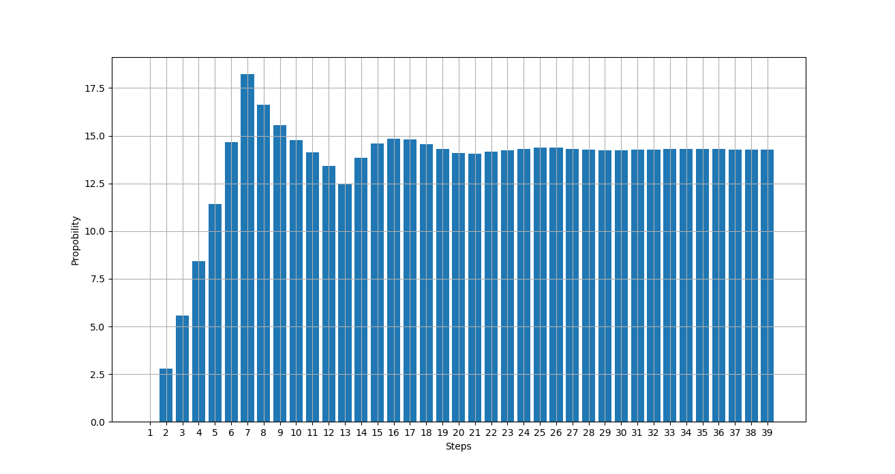

# Monopoly Calculator

### This script plots the probobility of the dice landing on a specific tile. this is not bounded by a single thow (the bars are independent of each other).



## This can be used to make smart investment when playing Monopoly

## How to run

### Windows (anaconda prompt)
```
py main.py <number of moves>
```
### Linux
```
python3 main.py <number of moves>
```
